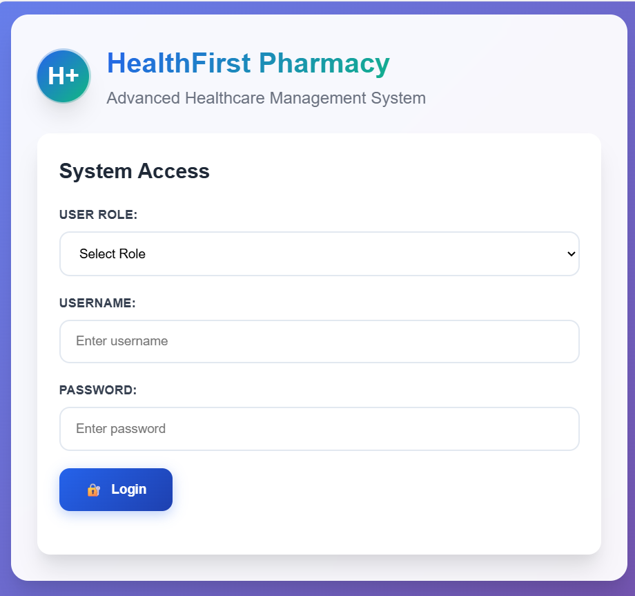

# 🏥 HealthFirst Pharmacy – Risk Assessment & Demo Web Application  

## 📌 About the Organization  
**HealthFirst Pharmacy** is a trusted provider of local healthcare, with the mission of caring for every person who walks through the door. Patients depend on HealthFirst daily for:  
- ✅ Quality prescriptions  
- ✅ Insightful and caring advice  
- ✅ A warm sense of service  

This personalized care is supported by a **comprehensive digital infrastructure** that ensures smooth operations while maintaining patient records securely.  

At the core of its operations are three critical systems:  
1. **Electronic Medical Records (EMR) System** – Stores medical histories, prescriptions, and treatment plans for accurate and real-time patient care.  
2. **Patient Prescription Database** – Manages medications, dosages, and refills while ensuring safe prescription handling and preventing drug interactions.  
3. **Inventory Management System (IMS)** – Tracks medicine stocks, sends alerts for low supplies, and supports financial management by monitoring supplier transactions.  

Together, these systems ensure HealthFirst delivers **safe, efficient, and personalized care**.  

---

## 🛡️ Risk Assessment  
This project involved conducting a **Risk Assessment** of HealthFirst Pharmacy’s digital infrastructure.  

🔹 **My responsibility:** `Inventory Management System (IMS)`  

### Key Risks Identified in IMS  
| Threat | Vulnerability | Impact | Mitigation |
|--------|--------------|--------|------------|
| Stock mismanagement (over/under-stocking) | Manual errors or outdated data | Shortages or excess wastage of medicines | Automated stock alerts & validation checks |
| Data breaches | Weak access control | Leakage of supplier or stock data | Implement role-based access & encryption |
| System downtime | Server/DB failure | Inability to dispense medicines | Regular backups & disaster recovery plan |
| Unauthorized access | Poor authentication | Manipulation of stock data | Strong login policies & monitoring |
| Integration failure with EMR/DB | Improper API/DB sync | Incorrect stock or prescription data | Regular integration testing & monitoring |

---

## 💻 Demo Web Application  
To demonstrate these systems in practice, we built a **demo web application** using:  
- 🌐 **HTML**  
- 🎨 **CSS**  
- ⚡ **JavaScript**  

The demo simulates the operations of:  
- **EMR System**  
- **Patient Prescription Database**  
- **Inventory Management System (IMS)** *(my module)*  

---

## 🚀 Features of IMS (My Module)  
- ➕ Add, update, and remove medicines  
- 📊 Real-time stock tracking  
- 🔔 Low-stock alerts  
- 📑 Supplier transaction monitoring  
- 👨‍💻 Simple UI for pharmacy staff  

---
 

